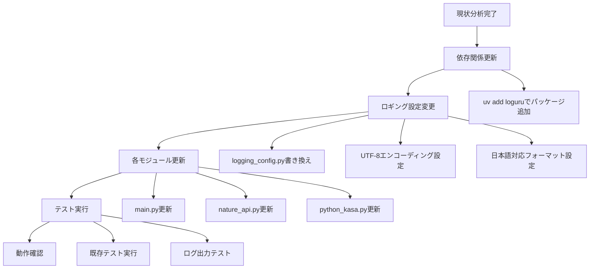

# Loguru移行プラン

## 概要
このプロジェクトのロギングライブラリをPython標準の`logging`モジュールから`loguru`に移行し、日本語文字化け問題を解決する。

## 現状分析

### 現在の構成
- **ロギングライブラリ**: Python標準の`logging`モジュール
- **問題**: ログファイル(app.log)で日本語が文字化け
- **ロギング使用箇所**: 
  - メインループでの情報ログ
  - エラーハンドリング
  - デバッグメッセージ
- **現在の設定**: UTF-8エンコーディング指定なし

### 影響範囲
- `src/nature_remo_con/main.py`
- `src/nature_remo_con/monitoring/nature_api.py`
- `src/nature_remo_con/control/python_kasa.py`
- `src/nature_remo_con/logging_config.py`

## 移行プラン



## 詳細実装手順

### 1. 依存関係の更新
**コマンド**:
```bash
uv add loguru
```

### 2. ロギング設定の刷新
**ファイル**: `src/nature_remo_con/logging_config.py`

```python
from loguru import logger
import sys

def setup_logging():
    """Loguruを使用したロギング設定(日本語対応)"""
    # 既存のハンドラーを削除
    logger.remove()
    
    # コンソール出力(UTF-8対応、カラー表示)
    logger.add(
        sys.stdout,
        format="<green>{time:YYYY-MM-DD HH:mm:ss}</green> | <level>{level: <8}</level> | <cyan>{name}</cyan>:<cyan>{function}</cyan>:<cyan>{line}</cyan> - <level>{message}</level>",
        level="INFO",
        colorize=True
    )
    
    # ファイル出力(UTF-8明示指定、ローテーション対応)
    logger.add(
        "app.log",
        format="{time:YYYY-MM-DD HH:mm:ss} | {level: <8} | {name}:{function}:{line} - {message}",
        level="INFO",
        encoding="utf-8",
        rotation="10 MB",
        retention="7 days",
        compression="zip"
    )
    
    return logger
```

### 3. 各モジュールの更新

#### 3.1 main.py
**変更前**:
```python
import logging
from .logging_config import setup_logging

# 使用例
logging.info("メッセージ")
logging.error("エラーメッセージ", exc_info=True)
```

**変更後**:
```python
from loguru import logger
from .logging_config import setup_logging

# 使用例
logger.info("メッセージ")
logger.error("エラーメッセージ")
```

#### 3.2 nature_api.py
**変更箇所**:
- `import logging` → `from loguru import logger`
- `logging.error()` → `logger.error()`

#### 3.3 python_kasa.py
**変更箇所**:
- `import logging` → `from loguru import logger`
- `logging.info()` → `logger.info()`
- `logging.error()` → `logger.error()`
- `logging.debug()` → `logger.debug()`

### 4. Loguruの利点

#### 4.1 日本語文字化け問題の解決
- **UTF-8デフォルト**: エンコーディング問題の根本解決
- **明示的エンコーディング指定**: ファイル出力時のUTF-8保証

#### 4.2 機能向上
- **シンプルなAPI**: より直感的な使用方法
- **構造化ログ**: JSON形式での出力も可能
- **自動ローテーション**: ログファイルサイズ管理
- **カラー出力**: コンソールでの視認性向上
- **圧縮機能**: 古いログファイルの自動圧縮

#### 4.3 パフォーマンス
- **遅延評価**: f-string使用時のパフォーマンス向上
- **非同期対応**: asyncio環境での安定動作

### 5. 移行チェックリスト

- [x] `uv add loguru`でパッケージ追加
- [x] `logging_config.py`の完全書き換え
- [x] `main.py`のimport文とロギング呼び出し更新
- [x] `nature_api.py`のロギング呼び出し更新
- [x] `python_kasa.py`のロギング呼び出し更新
- [ ] 既存テストの実行確認
- [ ] 日本語ログ出力テスト
- [ ] ログファイルローテーション動作確認

### 6. テスト方法

#### 6.1 日本語出力テスト
```python
logger.info("日本語テストメッセージ:正常に表示されるかテスト")
logger.error("エラーメッセージ:例外処理のテスト")
```

#### 6.2 ログファイル確認
1. アプリケーション実行
2. `app.log`ファイルをUTF-8で開く
3. 日本語文字が正しく表示されることを確認

### 7. ロールバック計画

万が一問題が発生した場合:
1. `uv remove loguru`でパッケージ削除
2. 各ファイルのimport文を元に戻す
3. `logging_config.py`を元の実装に戻す

### 8. 期待される効果

- **日本語文字化け問題の完全解決**
- **ログの可読性向上**(カラー表示、構造化)
- **保守性向上**(シンプルなAPI)
- **運用性向上**(自動ローテーション、圧縮)
- **デバッグ効率向上**(詳細な位置情報)

## 実装優先度

1. **高**: 依存関係更新とlogging_config.py書き換え
2. **高**: main.pyの更新(メインループ)
3. **中**: 各モジュールの段階的更新
4. **低**: テスト追加と動作確認

## 注意事項

- 移行作業は段階的に実施し、各段階で動作確認を行う
- 既存のログファイルは移行前にバックアップを取る
- テスト環境での十分な検証後に本番適用する